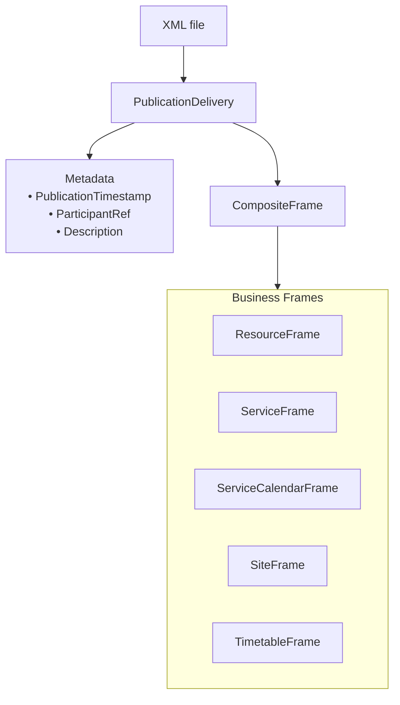
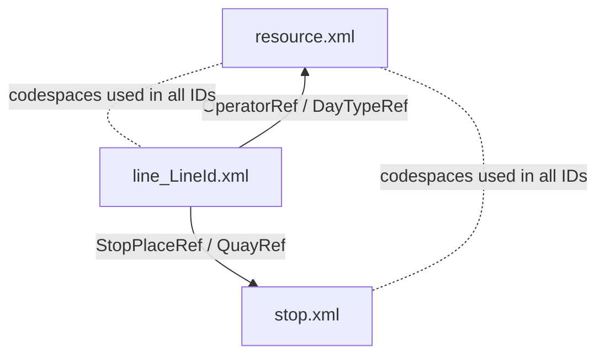

# 3. Organisation of Data

## 3.1 PublicationDelivery (the exchange envelope)

Each XML file is a NeTEx **PublicationDelivery**: an envelope containing one `CompositeFrame` and essential metadata (issuer, timestamp, description).

For the MVP, the CFL profile applies the following rules:

- **One PublicationDelivery per XML file.**
- **One CompositeFrame per XML file.**
- **The CompositeFrame may contain one or several business frames, depending on the role of the file:**
  - `resource.xml` contains several frames (a `ResourceFrame`, a `ServiceFrame` for transfer connections, and a `ServiceCalendarFrame`).
  - `stop.xml` contains a single `SiteFrame`.
  - Each line-specific file contains one `ServiceFrame` and one `TimetableFrame`.

- **Mandatory metadata** include:
  - `PublicationTimestamp`
  - `ParticipantRef`
  - a human-readable `Description`

This approach keeps each file small, focused, and easy to validate.

Although NeTEx permits combining multiple business frames within a CompositeFrame, the CFL MVP profile applies a documented and predictable structure per file type. This approach is adopted to:

- keep files **small**, **focused**, and **easy to validate** (XSD and Schematron);
- simplify **interpretation**, **maintenance**, and onboarding for new contributors;
- support **incremental updates** by allowing selective regeneration of specific files;
- ensure **consistency** across all WP1 publications and future work packages;
- reduce the risk of ambiguous or unintended cross-frame dependencies.

This constrained structure remains fully compliant with NeTEx while providing clearer boundaries between responsibilities of each file.

---

## 3.2 File Structure and Roles

The CFL dataset is divided into several XML files.  
Each file has a **precise functional scope**, contains **one CompositeFrame**, and is the **only authoritative source** for the entities it defines.  
Other files may reference these entities but must not redefine them.

This section describes for each file:
1. the frames it contains,  
2. the entities it defines locally,  
3. its intended scope and usage.

---

### 3.2.1 `resource.xml` — Shared Reference Data

**Frames**
- `ResourceFrame`
- `ServiceCalendarFrame`
- *(optional)* `ServiceFrame` for shared transfer connections

**Entities defined locally**
- Codespaces and data source metadata  
- Organisations, Operators, Authorities  
- Notices and other shared textual elements  
- TypeOfValue and other value sets or enumerations  
- ServiceFacilitySet and shared facilities  
- PhysicalConnection, Transfer, TransferDuration  
- DayType, OperatingPeriod, OperatingDay, DayTypeAssignment  

**Scope and role**
- Serves as the **central shared referential** for the entire dataset  
- Contains all elements reused across several files  
- No stop- or line-specific entities are defined here  

---

### 3.2.2 `stop.xml` — Stop and Platform Referential

**Frame**
- `SiteFrame`

**Entities defined locally**
- StopPlace  
- Quay  
- *(optional)* StopPlaceEquipment / SiteEquipment  
- *(optional)* Zones if required later  

**Scope and role**
- Provides the **complete national stop register** used by all lines  
- All stop-related identifiers referenced in other files originate here  

---

### 3.2.3 `line_<LineId>.xml` — Line Structure and Timetable

**Frames**
- `ServiceFrame`
- `TimetableFrame`

**Entities defined locally**

**ServiceFrame**
- Line  
- Route, RoutePoint, PointOnRoute  
- ServiceLink  
- JourneyPattern  
- StopPointInJourneyPattern  

**TimetableFrame**
- ServiceJourney  
- VehicleJourney  
- PassingTime  
- *(if used)* JourneyPatternRunTimes, WaitTimes, DayTypeAssignment  

**Scope and role**
- Defines the **complete service structure and timetable** for a single commercial line  
- Each line has its own file  
- Several timetable periods may be grouped in one file when appropriate  

---

### 3.2.4 `network.xml` — Optional Network-Level Structures  
*(Not included in WP1)*

**Frames**
- `NetworkFrame` or `ServiceFrame` (depending on future modelling choices)

**Entities defined locally**
- Network  
- GroupsOfLines, marketing/tariff structures (future extensions)

**Scope and role**
- Reserved for future work packages  
- Not delivered in WP1  

---

### 3.2.5 Summary Table

| File | Frames Included | Entities Defined Locally (Authoritative) | Purpose |
|------|-----------------|------------------------------------------|---------|
| `resource.xml` | `ResourceFrame`, `ServiceCalendarFrame`, optional `ServiceFrame` | Operators, codespaces, notices, facilities, physical connections, calendar elements | Shared reference elements used across all files |
| `stop.xml` | `SiteFrame` | StopPlace, Quay, equipment | National stop and platform register |
| `line_<LineId>.xml` | `ServiceFrame` + `TimetableFrame` | Line, routes, journey patterns, vehicle journeys, passing times | Service structure and timetable of one commercial line |
| `network.xml` (optional) | `NetworkFrame` or `ServiceFrame` | Network, groups of lines (future) | Network-level or tariff structures (not WP1) |

---

## 3.3 Naming Rules

This section defines the naming conventions applied to XML files in the CFL NeTEx dataset.  
Filenames must remain predictable and stable across deliveries.

---

### 3.3.1 Shared files

Two filenames are fixed and do not vary:

- `resource.xml`
- `stop.xml`

These filenames do not include timestamps, versions or operator names.

---

### 3.3.2 Line-specific files

Line files follow the naming pattern:

**`line_<LineIdentifier>.xml`**

The `<LineIdentifier>` is derived from the identifier of the corresponding `Line` entity, typically using the suffix of the NeTEx ID (the portion appearing after `LU:CFL:Line:`).

**Examples**
- `line_8200001-8200027.xml`
- `line_8200001-8200095-via-8200060.xml`

Multiple timetable periods for the same line may be grouped within a single file when appropriate.

---

### 3.3.3 Multi-operator considerations

In national aggregated publications:

- XML filenames remain **operator-neutral**.
- Operator information must appear only inside the XML data (e.g. `OperatorRef`, `AuthorityRef`), never in filenames.

If multiple operators publish their own ZIP archives:

- The **ZIP filename** may include operator information.
- The XML filenames **inside** the ZIP must remain stable and operator-neutral.

---

### 3.3.4 Codespaces

All codespaces used in identifiers (e.g. `LU:CFL`, `LU:RGTR`, `LU:TICE`) must:

- be declared in the `ResourceFrame` of `resource.xml`,
- be used consistently across all files,
- remain stable across deliveries.

---

## 3.4 Cross-File Reference Model

This section describes how entities defined in different XML files refer to each other.  
Three principles govern the model:  
1. stable identifiers,  
2. a single authoritative source per entity type,  
3. references using …Ref fields.

---

### 3.4.1 Identifier Model

Identifiers (`id`) are globally unique and stable across deliveries.  
They follow these rules:

- an identifier never changes once assigned;  
- new versions of an entity must reuse the same identifier;  
- identifiers are never reused for unrelated entities;  
- each identifier includes a declared codespace (e.g. LU:CFL).

Examples:

- `LU:CFL:StopPlace:SP00045`  
- `LU:CFL:Quay:BASCHARAGE-SANEM-1`  
- `LU:CFL:Line:8200001-8200027`  

Codespaces used in identifiers are declared in `resource.xml`.

---

### 3.4.2 Authoritative Source Model

Each entity type is defined in exactly one file.  
This prevents duplication and ensures consistent maintenance.

**stop.xml**  
- StopPlace  
- Quay  

**resource.xml**  
- Codespaces  
- Organisations, Operators, Authorities  
- Notices, ValueSets  
- Physical connections  
- Calendar primitives (DayType, OperatingPeriod, OperatingDay)

**line_<LineId>.xml**  
- Line  
- Route and RoutePoints  
- ServiceLink  
- JourneyPattern and StopPointInJourneyPattern  
- ServiceJourney and VehicleJourney  
- PassingTime

No entity type is defined in more than one file.

---

### 3.4.3 Reference Model

When an entity needs to refer to an entity defined in another file, it uses a NeTEx reference field (`…Ref`).

Examples:

- A `StopPointInJourneyPattern` references a `Quay` using `QuayRef`.  
- A `ServiceJourney` references a `DayType` using `DayTypeRef`.  
- A `Line` references an operator using `OperatorRef`.

Rules:

- Entities defined in another file must never be redefined locally.  
- A reference must always use the identifier of the authoritative source.  
- Referenced identifiers must be resolvable within the current delivery or a previous valid baseline/reference delivery.  
- Deprecated entities remain valid through versioning and temporal validity.

---

### 3.4.4 Cross-File Reference Overview

Cross-file references follow a simple structure:

- **Lines → Stops**  
  Line files reference StopPlace and Quay from `stop.xml`.

- **Timetables → Calendars**  
  ServiceJourney and VehicleJourney reference DayType from `resource.xml`.

- **Lines → Operators**  
  Line elements reference operators from `resource.xml`.

This compact diagram summarises these relationships :

---

## 3.5 Publication Bundles

Publication bundles define how XML files are grouped for delivery.  
Each bundle is a ZIP archive containing one or more XML files.  
The type of bundle depends on the scope of the changes being published.

Bundles must remain internally consistent:  
- all references must be resolvable;  
- files must form a coherent snapshot.

---

### 3.5.1 Bundle Types

| Bundle type            | resource.xml                 | stop.xml                 | line_<LineId>.xml                                    | When used / Notes |
|------------------------|------------------------------|---------------------------|-------------------------------------------------------|--------------------|
| **BaselineDelivery**   | ✓                            | ✓                         | ✓ (all line files)                                    | Initial deployment, full refresh, yearly reset, major structural changes. |
| **ReferenceDelivery**  | ✓                            | ✓                         | –                                                     | Only reference data changes (operators, calendars, stops). No timetable modifications. |
| **TimetableUpdate**    | –                            | –                         | ✓ (only affected lines)                               | Adjustments limited to timetables. Must not introduce new StopPlace/Quay unless stop.xml also included. |
| **CalendarUpdate**     | ✓ (ServiceCalendarFrame)     | –                         | ✓ (affected lines)                                    | Updates to DayTypes or operating periods requiring aligned line files. |
| **NewStopOrLine**      | ✓ or – depending on change   | ✓ or – depending on change | ✓ (affected lines)                                    | Introduction of new stops, quays, or new commercial lines. Files included ensure resolvability of new IDs. |
| **ModeSpecific**       | –                            | –                         | ✓ (all lines for the mode concerned)                 | Coordinated timetable update for a full mode (e.g. rail). |

---

### 3.5.2 Consistency Requirements

- All references must be resolvable within the bundle or within a previously published baseline/reference delivery that remains valid.  
- A timetable referencing a new StopPlace or Operator must be accompanied by the corresponding update to `stop.xml` or `resource.xml`.  
- A bundle must not depend on unpublished or external files.  
- Bundle composition must ensure unambiguous interpretation by consumers.

---

### 3.5.3 Examples of Bundle Usage

- **Timetable change on Line L60 only**  
  → bundle includes `line_<L60>.xml`

- **Addition of a new platform at Luxembourg**  
  → bundle includes updated `stop.xml` + any updated line files referencing the new quay

- **New public holiday definition**  
  → bundle includes `resource.xml` + all affected line files

---

## 3.6 Archiving and Delivery Naming

This section defines how publication bundles (ZIP archives) are named, published and archived.  
All deliveries must remain traceable, immutable and reproducible.

---

### 3.6.1 ZIP Archive Format

Each bundle is delivered as a single ZIP archive.

Inside the ZIP:
- XML filenames follow the conventions in section 3.3,  
- no timestamps or versions appear in XML filenames,  
- all XML files are placed at the root of the ZIP,  
- filenames must not be modified across deliveries.

---

### 3.6.2 Naming Convention for ZIP Archives

ZIP filenames follow this pattern:

**`LU_NeTEx_<BundleType>_<YYYYMMDDThhmmZ>.zip`**

Where:
- `<BundleType>` is one of the defined publication types (BaselineDelivery, ReferenceDelivery, TimetableUpdate, etc.).  
- `<YYYYMMDDThhmmZ>` is the UTC timestamp of the publication.

**Examples**
- `LU_NeTEx_BaselineDelivery_20250922T0600Z.zip`
- `LU_NeTEx_ReferenceDelivery_20251001T0400Z.zip`
- `LU_NeTEx_TimetableUpdate_20251115T1800Z.zip`

Each delivery must have a unique filename.

---

### 3.6.3 Immutability

Once published, a delivery must not be altered.

Rules:
- XML files inside a ZIP archive must not be modified.  
- ZIP archives must not be replaced or republished under the same name.  
- Any correction requires a new ZIP file with a new timestamp.

Immutability ensures reproducibility and reliable audit tracking.

---

### 3.6.4 Retention Policy

All published deliveries must be archived permanently.

Archived bundles serve as:
- historical datasets,  
- audit references,  
- reproducible sources for past timetable reconstruction.

Deliveries must not be deleted unless required by legal or regulatory constraints.

---

### 3.6.5 Relationship Between Deliveries

- A `BaselineDelivery` replaces the previous baseline but all baselines remain archived.  
- Updates (ReferenceDelivery, TimetableUpdate, CalendarUpdate, etc.) apply relative to the most recent baseline.  
- Consumers interpret the current dataset using the last baseline combined with all relevant updates.

Each published delivery must provide resolvable and consistent data.

---

## 3.7 Entity Versioning

Entity versioning ensures traceability of changes across deliveries and supports reconstruction of past states of the dataset.  
All entities defined in WP1 must include a `version` attribute and, when relevant, temporal validity information.

---

### 3.7.1 Version attribute

Each entity includes a `version` attribute.  
A new version must be created whenever any aspect of the entity changes, including:

- descriptive fields (e.g. name),  
- geometry or coordinates,  
- operational attributes,  
- structural relationships,  
- facilities or equipment.

Version values follow the NeTEx conventions (typically integers).

---

### 3.7.2 Temporal validity

Temporal validity is expressed using:

- `ValidFrom`,  
- `ValidTo`,  
- or `ValidBetween`.

These attributes define the period during which an entity version is applicable and allow consumers to interpret data for a given date.

---

### 3.7.3 Identifier stability

Identifiers remain stable across all versions of an entity.

Rules:
- A new version does **not** receive a new identifier.  
- Identifiers are never reused for unrelated entities.  
- Attribute changes do not alter the identifier.  
- All versions of an entity must be identifiable through the same ID.

Example:
- `StopPlace Luxembourg`: version 1 (ValidFrom 2018–01–01, ValidTo 2025–06–30) → version 2 (ValidFrom 2025–07–01).  
  Same ID, different versions.

---

### 3.7.4 Additive approach

The dataset uses an additive approach:

- Entities are not deleted when withdrawn.  
- Validity periods are closed using `ValidTo`.  
- Older versions remain present to maintain interpretability of historical timetables.

---

### 3.7.5 Relationship with publication bundles

- A BaselineDelivery may contain only the latest version of each entity.  
- Update bundles (TimetableUpdate, CalendarUpdate, etc.) may introduce new versions of existing entities.  
- Previous versions remain available in archived deliveries (section 3.6).

Entity versioning therefore remains consistent with the publication process.
