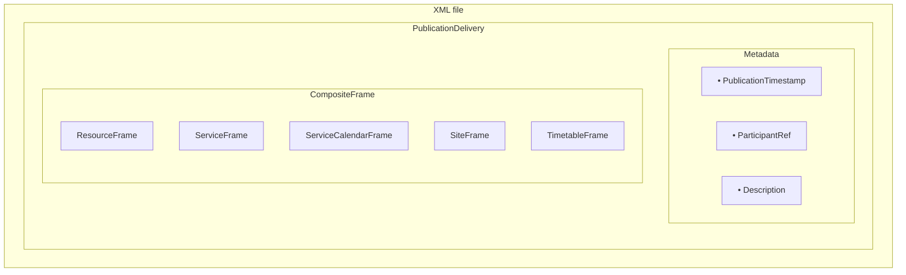

# 3. Data organisation

This section defines how the CFL NeTEx dataset is split into XML files and how responsibilities are distributed between them.

The goal is to:
- keep files **readable**, **stable**, and **easy to validate**;
- make **reuse explicit** (everything reused across several lines goes in shared files);
- avoid duplication and ambiguous ownership of entities.

---

## 3.1 PublicationDelivery and CompositeFrame

Each XML file is a NeTEx **PublicationDelivery** acting as an exchange envelope.

For the CFL MVP, each XML file follows these rules:

- **One PublicationDelivery per XML file**
- **One CompositeFrame per XML file**
- **One or more business frames inside the CompositeFrame**, depending on the functional role of the file
- **Mandatory metadata** in the PublicationDelivery:
  - `PublicationTimestamp`
  - `ParticipantRef`
  - `Description` (human-readable)

This ensures each file can be validated and understood independently, while still being part of the same delivery set (ZIP bundle).

Although NeTEx permits combining multiple business frames within a CompositeFrame, the CFL MVP profile applies a **documented and predictable structure per file type**. This approach is adopted to:

- keep files **small**, **focused**, and **easy to validate** (XSD and Schematron);
- simplify **interpretation**, **maintenance**, and onboarding for new contributors;
- support **incremental updates** by allowing selective regeneration of specific files;
- ensure **consistency** across all WP1 publications and future work packages;
- reduce the risk of ambiguous or unintended cross-frame dependencies.

This constrained structure remains fully compliant with NeTEx while providing clearer boundaries between responsibilities of each file.

---

## 3.2 Core file split (CFL MVP)

The CFL MVP dataset is organised around **shared reference files** and **line-specific files**.

The general rule is:

- **Everything reused by several line files is defined once** in `resource.xml` or `stop.xml`.
- **Everything specific to one commercial line** (service structure + timetable) is defined in one `line_<LineId>.xml`.

Some national profiles also introduce a dedicated **network layer** (`network.xml`) to describe multiple networks and, in some cases, support network-dependent rules (e.g. fares).

For CFL, this is currently not needed (**single network**, no network-dependent fare logic in scope).  
However, the concept is documented for completeness and as a potential evolution path for future extensions.

---

## 3.3 File roles and content

### 3.3.1 `resource.xml` — shared reference data reused across the bundle

`resource.xml` contains the dataset elements that are **shared across several lines** and must therefore **not be repeated** in each line file.

It is the authoritative source for reference objects that are reused within the same publication bundle (ZIP), in particular organisations, reusable reference lists, transfer connections, and calendar building blocks.

**Frames**
- `ResourceFrame`
- `ServiceCalendarFrame`
- *(optional)* `ServiceFrame` for shared transfer connections

**Entities usually defined here**
- **Organisations / Authorities / Operators**
  - CFL as authority (organising authority)
  - operators such as `CFL rail`, `CFL bus`, `CFL Flex` (with short name like *Flex*)
- **Vehicle types** (rolling stock / vehicle taxonomy used by journeys)
- **Reusable facilities** (`Facility` / `FacilitySet`, e.g. air conditioning)
- **Shared transfer connections** (when the same connection applies to multiple lines)
  - typically modelled as `SiteConnection` in a `ServiceFrame`
  - avoids duplicating walking times between the same points in multiple line files
- **Calendar primitives reused by multiple line files**
  - `DayType`
  - `OperatingPeriod`
  - `DayTypeAssignment` (link between the two)

**Principle**  
If multiple line files reference it, define it here once, assign a stable identifier, and reference it elsewhere using `…Ref` fields.

---

### 3.3.2 `network.xml` — optional (not used in CFL MVP)

Some national profiles introduce a dedicated file for networks when:
- multiple networks coexist in the same national dataset, and/or
- network membership drives specific rules (for example **fare policies** or network-dependent conditions).

For the CFL MVP:
- we currently consider a **single network**, therefore `network.xml` is **not required**.

This file split is kept as a **future option**, especially when extensions such as **fare**, **new modes**, or **national aggregation** are introduced and may require explicit network modelling.

---

### 3.3.3 `stop.xml` — stop infrastructure and stop hierarchy

`stop.xml` is the **authoritative register of physical stop infrastructure**.  
It contains the stop places (stations / stop areas), their internal structure, and the physical boarding locations used by passengers. All other files may **reference** these objects, but must not redefine them.

**Frame**
- `SiteFrame`

**Entities defined here (authoritative)**
- `StopPlace` (station / stop area)
- `Quay` (platform / boarding position)

#### Stop hierarchy

Stops are modelled using the NeTEx stop hierarchy, for example:
- a `StopPlace` representing a station or stop area,
- one or more `Quay` objects representing boarding locations within that `StopPlace`.

This file is where the dataset expresses the **physical reality** of stops, independently from the logical stop points used in service patterns (`ScheduledStopPoint`), which are defined in line files.

#### Multilingual stop naming

Stop names and other passenger-facing labels may be provided in multiple languages where needed.  
The multilingual strategy (which languages, which fields, fallback rules) is defined at profile level and applied consistently in `stop.xml`.

#### Geometry and localisation

`stop.xml` carries the localisation of stop infrastructure. Depending on the required precision, it may include:
- a simple `Centroid` (latitude / longitude),
- more detailed geometries (e.g. areas, polygons, GML-based representations), when relevant.

**CFL-specific modelling notes**
- **Rail quays** may be described with more precise geometry (e.g. start and end points along a platform) to reflect the railway platform layout.
- **Bus quays** are expected to be localised differently (often aligned with the physical pole position). This will be confirmed with GI (Gestion Infrastructure) and may evolve in later iterations.

#### Accessibility scope

Accessibility is part of the **stop infrastructure**, not of the timetable.  
Therefore, accessibility data is carried in `stop.xml`, typically via:
- `AccessibilityAssessment` and related structures.

The NeTEx accessibility extension (WP/Lot 3) will enrich this file without changing the overall split.

#### Optional internal codes (cross-system alignment)

When different internal systems require their own identifiers or viewpoints for the same physical object, `privateCode` may be used as a **non-public cross-reference** (e.g. GI vs railway operations).  

Rules:
- `privateCode` must not replace NeTEx identifiers;
- the NeTEx `id` remains the stable reference used across the dataset and for cross-file references.

---

### 3.3.4 `line_<LineId>.xml` — service offer and timetable for one commercial line

Each `line_<LineId>.xml` file is the **authoritative source for one commercial Line**.  
It combines, in a controlled and predictable way, the elements required to describe both:

1. the **service structure** (what the line is, what it serves, how it is patterned), and  
2. the **timetable** (the dated journeys and their passing times).

This split reflects NeTEx best practice: **physical infrastructure** belongs to `stop.xml`, while **logical service design + timetable** belong to the line file.

**Frames**
- `ServiceFrame` (service offer / structure)
- `TimetableFrame` (timetabled content)

---

#### A) ServiceFrame — service structure (the “servicial” layer)

The `ServiceFrame` describes the **commercial line offer** independently from any specific operating day.  
It defines the structure that the timetable will reference.

**Typical content**

- **`Line`**  
  The commercial line itself, including its description and references to shared data (e.g. `OperatorRef` from `resource.xml`).

- **`Direction`**  
  Usually two directions (outbound / inbound), used to structure the offer and support passenger information.

- **`ScheduledStopPoint` (logical stops)**  
  The list of logical stop points served by the line.  
  These are **service-level objects** used in patterns and timetable logic.

  > Important: `ScheduledStopPoint` is **not** a physical stop.  
  > Physical stops (`StopPlace`, `Quay`) are defined in `stop.xml`.

- **`PassengerStopAssignment` (logical ↔ physical binding)**  
  This is the key object that links the service offer to the stop infrastructure:
  - it references the **logical stop** (`ScheduledStopPointRef`),
  - it references the **physical stop place** (`StopPlaceRef`),
  - and it may also reference a **specific quay** (`QuayRef`) when a stable assignment is published.

  This mechanism is how CFL expresses the stop mapping explicitly (unlike GTFS, which often collapses the two levels).

- **`ServiceLink` (links between logical stops)**  
  Links between consecutive logical points, used to describe the topology of the service:
  - `FromPointRef` and `ToPointRef` reference `ScheduledStopPoint`.

- **`ServiceJourneyPattern` and `StopPointInJourneyPattern` (commercial missions and stop sequences)**  
  Patterns describe the “missions” operated on the line and the ordered sequence of stops they serve.
  Each pattern includes:
  - an ordered list of `StopPointInJourneyPattern` in `pointsInSequence`,
  - passenger rules per stop (`ForBoarding`, `ForAlighting`),
  - optional passenger information rules such as `ChangeOfDestinationDisplay` when relevant.

The `ServiceFrame` therefore provides a stable, reusable structure that the `TimetableFrame` will instantiate through journeys and passing times.

---

#### B) TimetableFrame — timetable content (journeys and passing times)

The `TimetableFrame` contains the **operational timetable** for the line: the journeys that run on specific operating days and the times at which they serve the stops defined in the service structure.

It does **not** redefine the service offer. Instead, it **instantiates** it by referencing:
- the stop sequence defined in `ServiceJourneyPattern`,
- the calendar definitions from `resource.xml`,
- and (when needed) vehicle and mode information.

**Typical content**

- **Journeys** (`ServiceJourney` / `VehicleJourney`, depending on the modelling choices)  
  Each journey represents one operated run of the line, linked to:
  - a service pattern (`ServiceJourneyPatternRef`),
  - a calendar applicability (`DayTypeRef`),
  - and, if relevant, operational attributes such as mode and vehicle type.

- **Passing times** (`TimetabledPassingTime`)  
  The timetable itself is expressed through passing times, typically grouped under the journey in a `PassingTimes` container.  
  Each `TimetabledPassingTime`:
  - references the planned stop in the sequence using `StopPointInJourneyPatternRef`,
  - carries the time information (`ArrivalTime`, `DepartureTime`) when applicable.

**References used in the TimetableFrame**

- **Calendar references (from `resource.xml`)**
  - `DayTypeRef` specifies on which operating day types the journey runs.

- **Service structure references (from the same line file’s `ServiceFrame`)**
  - `ServiceJourneyPatternRef` binds the journey to its stop sequence and mission definition.

- **Vehicle / mode references**
  - `VehicleTypeRef` may be used to describe the planned vehicle category.
  - `TransportMode` and related attributes can be used where the mode is relevant for passengers or consumers.

---

##### Multi-mode and rail replacement bus

NeTEx allows different transport modes to coexist within the same line file when this reflects the published offer (for example, a line that may be operated partly by train, partly by bus, depending on the period or disruption scenario).

For **rail replacement services**, a common modelling approach is:
- set the journey mode as bus,
- and specify a replacement nature using `TransportSubMode`, e.g. `railReplacementBus` under `BusSubmode`.

This enables consumers to distinguish a normal bus service from a rail replacement operation, without changing the overall line structure.

---

##### Handling skipped stops and detours

When a journey does not serve a planned stop, there are two main options depending on how frequent / structural the change is:

- **Occasional or journey-specific skip**  
  → remove the corresponding `TimetabledPassingTime` for that journey (the pattern remains unchanged, only that run skips the stop).

- **Frequent or structurally different routing**  
  → adjust the service structure by defining or updating the `ServiceJourneyPattern` (i.e., move the change up to the pattern level so that journeys reference the appropriate pattern).

This keeps the modelling consistent: the `TimetableFrame` expresses *instances*, while the `ServiceFrame` expresses the stable service design.

---

### 3.3.5 Summary table

| File | Frames included | Entities defined locally (authoritative) | Purpose |
|------|-----------------|------------------------------------------|---------|
| `resource.xml` | `ResourceFrame`, `ServiceCalendarFrame`, *(optional)* `ServiceFrame` | organisations/operators/authority; reusable reference lists; shared transfer connections; calendar primitives (`DayType`, `OperatingPeriod`, `DayTypeAssignment`); vehicle types; reusable facilities | Shared reference data reused across the bundle and across line files |
| `stop.xml` | `SiteFrame` | `StopPlace`, `Quay`; stop hierarchy; localisation/geometry; accessibility structures (e.g. `AccessibilityAssessment`) | Stop and platform (boarding location) register used by all line files |
| `line_<LineId>.xml` | `ServiceFrame`, `TimetableFrame` | `Line`, `Direction`, `ScheduledStopPoint`; `PassengerStopAssignment`; patterns and links (`ServiceJourneyPattern`, `StopPointInJourneyPattern`, `ServiceLink`); journeys and passing times (`ServiceJourney`/`VehicleJourney`, `TimetabledPassingTime`) | Complete service structure and timetable for one commercial Line |
| *(optional)* `network.xml` | *(profile-dependent)* | network definitions and membership (when required) | Optional network layer for multi-network contexts and network-dependent rules (e.g. fares) |

---

## 3.4 Cross-file reference model (ownership + references)

This section defines how responsibilities are split across files and how cross-file references must be handled.

The CFL MVP applies two strict rules:
1. **Single ownership**: each entity type is defined in exactly one file (authoritative source).
2. **Reference-only reuse**: other files may only *reference* that entity using `…Ref` fields and must never redefine it.

This prevents duplication, conflicting definitions, and unclear maintenance responsibilities.

---

### 3.4.1 Ownership principle

Each entity type has a **single authoritative source file**:

- **`resource.xml` (shared reference)**
  - Organisations, Operators, Authorities
  - Calendar primitives shared across lines:
    - `DayType`
    - `OperatingPeriod`
    - `DayTypeAssignment`
  - Shared reference objects reused across lines:
    - vehicle types
    - shared facilities / facility sets
    - shared transfer connections (e.g. site connections)

- **`stop.xml` (stop infrastructure)**
  - `StopPlace`
  - `Quay`
  - stop hierarchy and localisation
  - accessibility structures (e.g. `AccessibilityAssessment`)

- **`line_<LineId>.xml` (line offer + timetable)**
  - service offer (logical and structural layer):
    - `Line`, `Direction`, `ScheduledStopPoint`
    - `PassengerStopAssignment`
    - patterns and topology: `ServiceJourneyPattern`, `StopPointInJourneyPattern`, `ServiceLink`
  - timetable layer:
    - journeys (e.g. `ServiceJourney` / `VehicleJourney`)
    - passing times (e.g. `TimetabledPassingTime`)

**Rule:** no entity type is defined in more than one file.  
If an entity is needed outside its authoritative file, it must be used through a reference (`…Ref`) to the authoritative identifier.

---

### 3.4.2 Reference principle

When an entity needs to use an object defined in another file, it must do so **only by reference**.

**Rule:** cross-file reuse is performed using NeTEx reference elements (`…Ref`).  
The referenced object must **never** be redefined locally (no duplicate definition, no partial copy, no shadow object).

A reference is valid only if:
- it points to the **stable identifier (`id`)** of the authoritative object, and
- that identifier is resolvable within the same bundle (ZIP) or through an agreed baseline/reference delivery chain.

**Typical examples**
- `PassengerStopAssignment` references stop infrastructure from `stop.xml`:
  - `StopPlaceRef` is mandatory when binding a logical stop to a physical stop place,
  - `QuayRef` is optional and used only when a stable quay-level assignment is published.

- Journeys reference the shared calendar from `resource.xml`:
  - a journey uses `DayTypeRef` to express its operating applicability.

- The commercial line references shared organisational data from `resource.xml`:
  - `Line` uses `OperatorRef` (and, where relevant, `AuthorityRef`) to link the service offer to the responsible organisations.

**Consequences**
- A file may freely reference entities from other files, but must not “own” them.
- Any update to an authoritative entity must be made in its owning file only, then consumed via unchanged references.

---

## 3.5 Naming rules

This section defines the naming conventions applied to XML files produced in the CFL NeTEx dataset.  
Filenames must remain predictable and stable across deliveries.

### 3.5.1 Shared files

The following filenames are fixed and do not vary:

- `resource.xml`
- `stop.xml`
- *(optional, if introduced later)* `network.xml`

These filenames do not include timestamps, versions or operator names.

### 3.5.2 Line-specific files

Line files follow the naming pattern:

**`line_<LineId>.xml`**

The `<LineId>` is derived from the identifier of the corresponding `Line` entity, by using the suffix of the NeTEx ID (the portion appearing after `LU:CFL:Line:`).

**Examples**
- `line_8200001-8200027.xml`
- `line_8200001-8200095-via-8200060.xml`

Multiple timetable periods for the same line may be grouped within a single file when appropriate.

### 3.5.3 Multi-operator considerations

In national aggregated publications:

- XML filenames remain **operator-neutral**.
- Operator information must appear only inside the XML data (e.g., `OperatorRef`, `AuthorityRef`), never in filenames.

If multiple operators publish their own publication bundles (ZIP archives):

- The **ZIP filename** may include operator information.
- The XML filenames **inside** the ZIP must remain stable and operator-neutral.

### 3.5.4 Codespaces

All codespaces used in identifiers (e.g., `LU:CFL`, `LU:RGTR`, `LU:TICE`) must:

- be declared in the `ResourceFrame` of `resource.xml`;
- be used consistently across all files;
- remain stable across deliveries.

---

## 3.6 Identifier and versioning rules

This section defines the rules that ensure long-term consistency and traceability across deliveries.

### 3.6.1 Identifier stability

Identifiers (`id`) are globally unique and stable across deliveries.

Rules:
- an identifier never changes once assigned;
- new versions of an entity must reuse the same identifier;
- identifiers are never reused for unrelated entities;
- each identifier includes a declared codespace (e.g., `LU:CFL`).

**Examples**
- `LU:CFL:StopPlace:SP00045`  
- `LU:CFL:Quay:BASCHARAGE-SANEM-1`  
- `LU:CFL:Line:8200001-8200027`

Codespaces used in identifiers are declared in `resource.xml` (see 3.5.4).

### 3.6.2 Entity versioning (`version`)

All entities defined in WP1 must include a `version` attribute.

A new version must be created whenever any aspect of the entity changes, including:
- descriptive fields (e.g., name);
- geometry or coordinates;
- operational attributes;
- structural relationships;
- facilities or equipment.

Version values follow NeTEx conventions (typically integers).

### 3.6.3 Temporal validity

When relevant, temporal validity is expressed using:
- `ValidFrom`,
- `ValidTo`,
- or `ValidBetween`.

These attributes define the period during which an entity version is applicable and allow consumers to interpret data for a given date.

### 3.6.4 Additive approach

The dataset uses an additive approach:
- entities are not deleted when withdrawn;
- validity periods are closed using `ValidTo`;
- older versions remain available through archived deliveries, to support historical reconstruction.

---

## 3.7 Publication bundles and delivery policy

Publication bundles define how XML files are grouped for delivery.  
Each bundle is a ZIP archive containing one or more XML files. The bundle type depends on the scope of changes being published.

Bundles must remain internally consistent:
- all references must be resolvable;
- files must form a coherent snapshot.

### 3.7.1 Bundle types

| Bundle type            | `resource.xml` | `stop.xml` | `line_<LineId>.xml`                 | When used / Notes |
|------------------------|----------------|------------|-------------------------------------|-------------------|
| **BaselineDelivery**   | ✓              | ✓          | ✓ (all line files)                  | Initial deployment, comprehensive refresh, yearly reset, major structural changes. |
| **ReferenceDelivery**  | ✓              | ✓          | –                                   | Only reference data changes (operators, calendars, stops). No timetable modifications. |
| **TimetableUpdate**    | –              | –          | ✓ (only affected lines)             | Timetable-only adjustments. Must not introduce new StopPlace/Quay unless `stop.xml` is also included. |
| **CalendarUpdate**     | ✓ *(calendar)* | –          | ✓ (affected lines)                  | Updates to `DayType` / operating periods requiring aligned line files. |
| **NewStopOrLine**      | ✓ or –         | ✓ or –     | ✓ (affected lines)                  | Introduction of new stops/quays or new commercial lines. Files included ensure resolvability of new IDs. |

### 3.7.2 Consistency requirements

- All references must be resolvable within the bundle or within a previously published baseline/reference delivery that remains valid.
- A timetable referencing a new `StopPlace`, `Quay`, `Operator`, or `DayType` must be accompanied by the corresponding update to `stop.xml` and/or `resource.xml`.
- A bundle must not depend on unpublished or external files.
- Bundle composition must ensure unambiguous interpretation by consumers.

### 3.7.3 ZIP archive format and naming

Each bundle is delivered as a single ZIP archive. Inside the ZIP:
- XML filenames follow section 3.5;
- no timestamps or versions appear in XML filenames;
- all XML files are placed at the root of the ZIP.

ZIP filenames follow this pattern:

**`CFL_NeTEx_<BundleType>_<YYYYMMDDThhmmZ>.zip`**

Where:
- `<BundleType>` is one of the defined bundle types (BaselineDelivery, ReferenceDelivery, TimetableUpdate, etc.);
- `<YYYYMMDDThhmmZ>` is the UTC timestamp of the publication.

**Examples**
- `CFL_NeTEx_BaselineDelivery_20250922T0600Z.zip`
- `CFL_NeTEx_ReferenceDelivery_20251001T0400Z.zip`
- `CFL_NeTEx_TimetableUpdate_20251115T1800Z.zip`

### 3.7.4 Immutability and retention

Once published, a delivery must not be altered.

Rules:
- XML files inside a ZIP archive must not be modified;
- ZIP archives must not be replaced or republished under the same name;
- any correction requires a new ZIP file with a new timestamp.

All published deliveries must be archived permanently, unless legal or regulatory constraints require deletion. Archived bundles serve as:
- historical datasets;
- audit references;
- reproducible sources for past timetable reconstruction.
