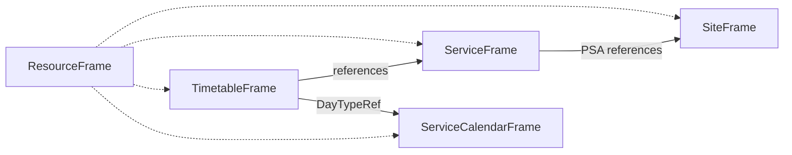

# 4. Frames and Entities Used in the MVP

## 4.1 Overview of Frames Used in the MVP

The MVP relies on a focused subset of NeTEx frames.  
Each frame groups entities that share a common conceptual scope (referentials, stops, service structure, timetables, calendars).  
The table below summarises the frames used and their purposes.

| Frame | Conceptual scope | Key entities (MVP) | Purpose |
|-------|------------------|---------------------|---------|
| **[ResourceFrame](#42-resourceframe)** | Shared reference data | Codespace, Operator, Notice, ValueSet, calendar primitives | Provides global identifiers, shared definitions and calendar elements. |
| **[ServiceCalendarFrame](#43-servicecalendarframe)** | Calendar definitions | DayType, OperatingPeriod, OperatingDay, DayTypeAssignment | Defines the operational calendar used by all scheduled circulations. |
| **[SiteFrame](#44-siteframe)** | Stop referential (physical infrastructure) | StopPlace, Quay | Provides the authoritative registry of stops and quays. |
| **[ServiceFrame (per line)](#45-serviceframe-per-line)** | Service structure (logical layer) | Line, Direction, ScheduledStopPoint, PassengerStopAssignment, JourneyPattern, StopPointInJourneyPattern, ServiceLink | Defines the line identity, the logical stop structure and patterns, and the mapping to physical stops. |
| **[TimetableFrame](#46-timetableframe)** | Scheduled times | VehicleJourney, TimetabledPassingTime | Describes planned circulations and their scheduled times aligned with the service structure. |

This overview introduces the frames that are described in detail in sections
[4.2](#42-resourceframe) to [4.6](#46-timetableframe).

For a consolidated view of all entities used in the MVP, see **[Section 4.7 – Summary table: Entities used in the MVP](#47-summary-table--entities-used-in-the-mvp)**.

For an overview of how frames interact, see **[Section 4.8 – Summary of frame interactions](#48-summary-of-frame-interactions)**.

---

## 4.2 ResourceFrame

The ResourceFrame contains the cross-cutting reference data required to interpret all other frames.  
It defines the common concepts that are reused throughout the dataset: identifiers, organisations, shared textual elements and calendar primitives.

---

### 4.2.1 Scope

The ResourceFrame groups the elements that:

- Are referenced by multiple frames (SiteFrame, ServiceFrame, TimetableFrame);
- Ensure consistent interpretation of identifiers and categories;
- Provide shared domain definitions (e.g., calendars, notices, controlled vocabularies).

Only concepts strictly required for the MVP timetable modelling are included.

---

### 4.2.2 Entities used in the MVP profile

**Identification structures**  
- Codespace  
- (Optional) ResponsibilitySet

**Organisational data**  
- Operator (CFL)  
- Organisation / Authority (minimal use, only if structurally required)

**Shared textual and categorical elements**  
- Notice  
- ValueSet / TypeOfValue

**Calendar model**  
- DayType  
- OperatingPeriod  
- OperatingDay  
- DayTypeAssignment  

These elements form the base calendar model used by all VehicleJourneys.

**Transfer connections** *(included only if modelled in MVP)*  
- Connection  
- Transfer  
- TransferDuration

---

### 4.2.3 Modelling rules (CFL MVP)

- All identifiers use codespaces declared in the ResourceFrame.
- Only elements with cross-cutting meaning are placed in the ResourceFrame.
- CFL is the sole Operator in MVP.
- DayTypes encode operational categories (e.g. weekdays, weekends, holidays).
- OperatingPeriods, OperatingDays and DayTypeAssignments define the validity calendar.
- Notices and value sets may be referenced from multiple frames.

---

### 4.2.4 Scope limitations

The ResourceFrame includes only the elements required for modelling CFL’s scheduled offer in MVP.  
Additional functional domains (accessibility, fares, real-time…) are out of scope at this stage.

---

## 4.3 ServiceCalendarFrame

The ServiceCalendarFrame provides the calendar structures used to describe the operational validity of services.  
It defines the temporal components required to express which days a service operates, on which periods the timetable applies, and how special dates are handled.

This frame acts as the temporal backbone of the timetable model in MVP.

---

### 4.3.1 Scope

The ServiceCalendarFrame groups the elements that define:

- Categories of operational days (day types);
- Periods of validity (continuous date ranges);
- Individual dates (operating days);
- How day types are assigned to dates.

Its purpose is to supply a unified, reusable calendar model shared by all VehicleJourneys.

This separation ensures that the service structure (ServiceFrame) and the timetable (TimetableFrame) can reference a stable, centralised calendar.

---

### 4.3.2 Entities used in MVP

The MVP profile uses the core NeTEx calendar primitives:

#### **DayType**
Represents a category of days (e.g., weekday, weekend, specific holiday group).  
Used by VehicleJourney to indicate the type of days on which it runs.

#### **OperatingPeriod**
Defines continuous date ranges during which services operate (e.g., "01/12/2025–14/12/2025" for a seasonal timetable).

#### **OperatingDay**
Represents a specific calendar date (ISO day).  
Used for exceptions or precise modelling of validity ranges.

#### **DayTypeAssignment**
Links DayTypes to specific dates or date ranges.  
Enables modelling of:

- Regular patterns (weekday, weekend);
- Special days (public holidays);
- Exceptional additions or removals of service.

---

### 4.3.3 Modelling rules (CFL MVP)

The calendar model in the MVP follows these principles:

- **DayTypes express categories of days**, not specific dates.  
  Examples: weekday, weekend, public holiday.

- **OperatingPeriods express continuous ranges** on which a timetable is valid.  
  Periods are used to limit the validity of a timetable dataset (e.g., summer season).

- **OperatingDays express individual dates** when fine-grained control is needed.

- **DayTypeAssignments combine all components**, ensuring that each date can be interpreted unambiguously.

- **DayTypes referenced by VehicleJourneys** must be defined in the ServiceCalendarFrame.

- **Calendar definitions must be consistent across all lines**: a DayType represents the same concept for all services.

This approach ensures predictable, reusable calendar structures across the entire CFL dataset.

---

### 4.3.4 Scope limitations

The ServiceCalendarFrame in the MVP includes only the elements necessary to support scheduled services.  
It does not model:

- Real-time operating days;
- School calendars or agency-specific calendars;
- Fare calendars;
- Resource availability calendars.

These elements may be modelled later if required, but are outside the scope of MVP.

---

## 4.4 SiteFrame

The SiteFrame contains the geographical and operational definition of stops used in the CFL dataset.  
It provides the spatial structure needed to describe where services operate: stations, platforms, quays, and their associated identifiers.

This frame forms the authoritative stop referential for the MVP.

---

### 4.4.1 Scope

The SiteFrame models the components that describe:

- The physical structure of stops and stations;
- The boarding locations used by passengers (quays/platform edges);
- The associated identifiers, names and coordinates.

It defines the stop topology independently from any specific line or timetable.  
ServiceFrames link their logical stop structure to StopPlace and Quay through PassengerStopAssignment (see section 4.5).

---

### 4.4.2 Entities used in MVP

The MVP focuses on the core stop entities required for scheduled services:

#### **StopPlace**
Represents a station or stop area.  
Key roles in MVP:
- Defines the geographical location of a stop;
- Groups one or several quays;
- Provides the stable, public-facing stop identity.

Typical attributes:
- Name  
- ShortName (if relevant)
- PublicCode  
- Centroid (coordinates expressed with Latitude/Longitude in WGS84)  
- StopPlaceType (e.g. “railStation”)  
- Multilingual names (if available)

#### **Quay**
Represents a platform edge or boarding position within a StopPlace.  
It is the physical place from which a passenger boards or alights.

Key roles:
- Provides quay-level boarding information when required by consumers;
- May be referenced from PassengerStopAssignment when stable quay assignment is published.

Typical attributes:
- Name  
- PublicCode (e.g. platform number)  
- privateCodes (i.e., the internal code of a scheduling or infrastructure system)
- QuayType  
- Coordinates (expressed with Latitude/Longitude in WGS84)

#### **(Optional) Topographic or grouping structures**
The MVP profile can include **GroupOfStopPlaces** (if grouping several StopPlaces is required), but only when necessary for multimodal coherence within CFL.

The MVP does **not** model complex hierarchies beyond what is strictly required for CFL stops.

---

### 4.4.3 Modelling rules (CFL MVP)

- **StopPlace is the authoritative public identity** of a stop.  
  Quays belong to exactly one StopPlace.

- **Identifiers for StopPlace and Quay are stable** and use CFL codespaces declared in the ResourceFrame.

- **Geographical coordinates are attached to StopPlace**  
  (Quays may also carry coordinates if required for precision).

- **Multilingual naming is optional**  
  and included only when available in source systems.

- **Stop topology is line-independent.**  
  A StopPlace must be defined once, regardless of the number of lines serving it.

---

### 4.4.4 Scope limitations

The SiteFrame in the MVP does **not** include:

- Detailed accessibility features (WP3 scope);
- Detailed station equipment or facilities;
- Internal station topology (paths, entrances, lifts);
- Fare zones; 
- Commercial areas;
- 3D geometry or indoor navigation structures.

The MVP restricts itself to the elements required for describing stop identity and (when needed) quay-level boarding references.

---

## 4.5 ServiceFrame (per line)

The ServiceFrame describes the logical service structure of a line.  
It defines the public service axis, the patterns followed by services, and the ordered sequence of stops used by scheduled journeys.  
This frame acts as the structural layer between the stop referential (SiteFrame) and the timetable (TimetableFrame).

---

### 4.5.1 Scope

The ServiceFrame models the **service structure independently from time and calendar**.  
It provides:

- The **public-facing identity** of the line;  
- One or more **JourneyPatterns** representing service variants;
- The ordered **StopPointInJourneyPattern** elements forming each pattern;
- The set of logical stop points served by the line (`ScheduledStopPoint`);
- The mapping between logical stops and physical stop infrastructure (`PassengerStopAssignment`);
- (Optional) the topology between consecutive logical stops (`ServiceLink`).

This structure is reused by all `VehicleJourney` instances belonging to the same line.

---

### 4.5.2 Entities used in the MVP

#### **Line**
Represents the public-facing axis of the service (e.g., Luxembourg–Arlon).  
It provides the stable identity under which all JourneyPatterns and VehicleJourneys of the line are grouped.

Typical attributes:
- Name  
- Description (optional)  
- Public-facing codes or service classification (e.g. RB/RE/IC), where relevant  
- OperatorRef (CFL)

---

#### **ScheduledStopPoint**
Represents a logical stop point used to describe the service structure.  
This layer is distinct from the physical stop infrastructure described in the SiteFrame.

ScheduledStopPoints are used consistently across:
- ServiceLinks (topology),
- JourneyPatterns (stop sequences),
- and, indirectly, passing times through the pattern structure.

---

#### **PassengerStopAssignment**
Links a ScheduledStopPoint to the physical stop infrastructure defined in the SiteFrame.

A PassengerStopAssignment:
- references the logical stop (`ScheduledStopPointRef`);
- references the physical station/stop area (`StopPlaceRef`);
- may reference a physical boarding location (`QuayRef`) when stable quay assignment is published.

This entity ensures that the dataset explicitly models the difference between logical stops (service design) and physical stops (infrastructure), while still allowing consumers to resolve the physical location.

---

#### **JourneyPattern**
Represents an ordered sequence of stops served by a particular pattern of the line.  
A line may have several JourneyPatterns to represent:
- Full-length services,  
- Partial or short-turn services,  
- Variants skipping certain stops.

JourneyPatterns structure the relationship between the line and the timetable.

---

#### **StopPointInJourneyPattern**
Represents a single stop within a JourneyPattern.  
It:

- Anchors the stop sequence and order within the pattern;
- Provides passenger exchange rules (ForBoarding / ForAlighting), where relevant;
- Acts as the reference point for scheduled times in the TimetableFrame via `StopPointInJourneyPatternRef`.

In the CFL MVP, the physical resolution (StopPlace/Quay) is handled via PassengerStopAssignment rather than by embedding physical stop infrastructure in the pattern itself.

---

#### **(Optional) ServiceLink**
Represents the link between two consecutive logical stops in the service structure.  
It references logical stop points via `FromPointRef` / `ToPointRef` (ScheduledStopPoint).

---

### 4.5.3 Modelling rules (MVP)

- The ServiceFrame contains **exactly one Line**.  
- All JourneyPatterns defined in the frame must belong to this Line.  
- JourneyPatterns represent **service variants**, not route geometry.  
- The ServiceFrame contains the logical stop structure and the mapping to physical infrastructure (PassengerStopAssignment).  
- The ServiceFrame remains independent from calendar definitions and from timing information. 
- VehicleJourneys refer to a JourneyPattern and apply time data through the TimetableFrame.

---

### 4.5.4 Scope limitations

The MVP ServiceFrame does **not** model:

- Route geometry or network topology;
- Operational train paths;
- Consist or composition information on rolling stock;
- Platform sectors or sub-quay subdivisions;
- Intermodal structures;
- Operational rules or signalling constraints.

Its purpose is limited to the **logical service structure** required for associating patterns and scheduled times within a Line.

---

## 4.6 TimetableFrame

The **TimetableFrame** describes the scheduled operation of services.  
It provides the **temporal dimension** of the offer by modelling the planned circulations of vehicles and the times at which they reach each stop defined in the ServiceFrame.

It depends on three other frames:

- The **SiteFrame**, which defines the physical stop infrastructure (StopPlace, Quay);  
- The **ServiceFrame**, which defines the logical service structure (Line, JourneyPattern, StopPointInJourneyPattern);  
- The **ServiceCalendarFrame**, which defines the operating days (DayTypes, OperatingPeriods, OperatingDays).

The TimetableFrame does not define structural or calendar elements.  
Its role is to express **when** each circulation operates and **what times** it observes at each stop.

---

### 4.6.1 Scope

The TimetableFrame contains all elements required to represent:

- Individual scheduled circulations (**VehicleJourney**); 
- The sequence of planned times at each stop (**TimetabledPassingTime**);
- The association of each circulation with operational days (**DayTypeRef**);
- The alignment between temporal data and the service structure.

In the MVP, this frame is limited to the **publicly published timetable information**.  
No operational-level structures are included.

---

### 4.6.2 Entities used in the MVP

#### **VehicleJourney**

A `VehicleJourney` represents **one planned circulation** of a CFL vehicle (typically a train).  
It corresponds to the public-facing notion of a departure following a specific pattern at scheduled times.

A `VehicleJourney`:

- References **exactly one `JourneyPattern`**; 
- References **one or more `DayTypes`** via `DayTypeRef`;
- Contains one `TimetabledPassingTime` element per `StopPointInJourneyPattern`.

**Typical attributes:**

- `JourneyPatternRef` (mandatory)  
- `DayTypeRef` (one or more)  
- Optional public identifiers (e.g., train number)  

In the MVP, **VehicleJourney is the primary timetable entity**.  
`ServiceJourney` is not used.

---

#### **TimetabledPassingTime**

A `TimetabledPassingTime` represents the scheduled time of a VehicleJourney:

- Arrives at a stop;
- Departs from a stop;
- Or passes through it.

Each `TimetabledPassingTime`:

- Is attached to one `StopPointInJourneyPattern` via `StopPointInJourneyPatternRef`;
- Provides `ArrivalTime` and/or `DepartureTime`;
- Must follow the exact order defined by the `JourneyPattern`.

`TimetabledPassingTime` elements provide the essential temporal information of the timetable.

---

#### **(Optional) Additional operational identifiers**

The MVP may include operational identifiers **only if strictly required**, such as:

- Train number;
- Mission identifier;
- Block number.

No further operational modelling is included.

---

### 4.6.3 Modelling rules (MVP)

#### **Link between structure and timetable**

- Each `VehicleJourney` must reference **one `JourneyPattern`**.  
- All `TimetabledPassingTime` elements must match the stop sequence of that `JourneyPattern`.  
- No `TimetabledPassingTime` may exist without a corresponding `StopPointInJourneyPattern`.

The structural and temporal models must remain fully aligned.

---

#### **Calendar association**

- Each `VehicleJourney` must reference **at least one `DayType`**.  
- `DayTypeRef` defines operational validity.  
- DayTypeAssignments from the ServiceCalendarFrame provide the actual list of operating dates.

No validity information is carried directly in the TimetableFrame.

---

#### **Temporal consistency**

- `ArrivalTime` and `DepartureTime` must be consistent and non-contradictory.  
- `TimetabledPassingTime` elements must form a coherent sequence (no negative travel times).  
- Times must be present for all stops actually served.

---

#### **VehicleJourney as the primary unit**

In the MVP:

- **VehicleJourney is the sole representation of scheduled services**;
- No `ServiceJourney` is defined;
- No operational decomposition or rolling-stock assignment is modelled.

---

### 4.6.4 Scope limitations

The TimetableFrame does **not** include:

- Real-time information or predictions;
- Service deviations or temporary alterations;
- Dynamic platforming or sector-level platform assignments;
- Consist/rolling-stock details;
- Crew or duty planning;
- Operational timing constraints (minimum dwell, margins).

Its scope is intentionally limited to **planned, published timetable data**.

## 4.7 Summary table : Entities used in the MVP

| Entity | Frame | Definition | Role in the MVP | Mandatory |
|--------|--------|-------------|------------------|-----------|
| **Codespace** | ResourceFrame | Namespace defining the scope of identifiers. | Ensures global uniqueness of all IDs. | ✅ |
| **Operator** | ResourceFrame | Organisation running the service. | Identifies CFL as service provider. | ✅ |
| **Notice** | ResourceFrame | Shared textual note. | Optional informational messages. | ⚪ Optional |
| **DayType** | ServiceCalendarFrame | Category of operating days. | Associates VehicleJourneys with the calendar. | ✅ |
| **OperatingPeriod** | ServiceCalendarFrame | Continuous date range. | Defines long-term validity spans. | ⚪ Optional |
| **OperatingDay** | ServiceCalendarFrame | Single calendar date. | Used when dates must be enumerated. | ⚪ Optional |
| **DayTypeAssignment** | ServiceCalendarFrame | Assignment of DayType to specific dates. | Produces the final operational calendar. | ✅ |
| **StopPlace** | SiteFrame | Station or stop area. | Public identity of a stop. | ✅ |
| **Quay** | SiteFrame | Boarding point / platform edge. | Physical boarding location; referenced via PSA when quay-level assignment is published. | ✅ |
| **Line** | ServiceFrame | Public axis of service (e.g., “Luxembourg–Arlon”). | Groups all patterns and journeys of the line. | ✅ |
| **Direction** | ServiceFrame | Direction of travel. | Structures offer for passenger information. | ✅ |
| **ScheduledStopPoint** | ServiceFrame | Logical stop point used in service design. | Anchor for patterns and topology; mapped to physical stops via PSA. | ✅ |
| **PassengerStopAssignment** | ServiceFrame | Mapping between logical stop and physical infrastructure. | Links ScheduledStopPoint to StopPlace (and optionally Quay). | ✅ |
| **JourneyPattern** | ServiceFrame | Ordered sequence of stops for a service variant. | Structural reference for VehicleJourneys. | ✅ |
| **StopPointInJourneyPattern** | ServiceFrame | One stop in the pattern. | Defines stop order used by passing times. | ✅ |
| **VehicleJourney** | TimetableFrame | One scheduled circulation of a vehicle. | Core unit of the timetable (planned run). | ✅ |
| **TimetabledPassingTime** | TimetableFrame | Arrival/departure time at a pattern stop. | Provides the temporal dimension of the timetable. | ✅ |

---

## 4.8 Summary of frame interactions

The frames described in this chapter are not isolated components: they work together to form a coherent, structured timetable dataset.

- **SiteFrame** defines the physical locations used by services (StopPlace, Quay).  
- **ServiceFrame** defines the logical service structure (Line, ScheduledStopPoint, JourneyPattern) and maps logical stops to physical infrastructure via PassengerStopAssignment.  
- **TimetableFrame** instantiates concrete journeys and their times (VehicleJourney, TimetabledPassingTime).  
- **ServiceCalendarFrame** defines when these journeys operate (DayType, assignments).  
- **ResourceFrame** provides shared metadata required by all other frames (Codespace, Operator, Notices).

The diagram below summarises these interactions:

